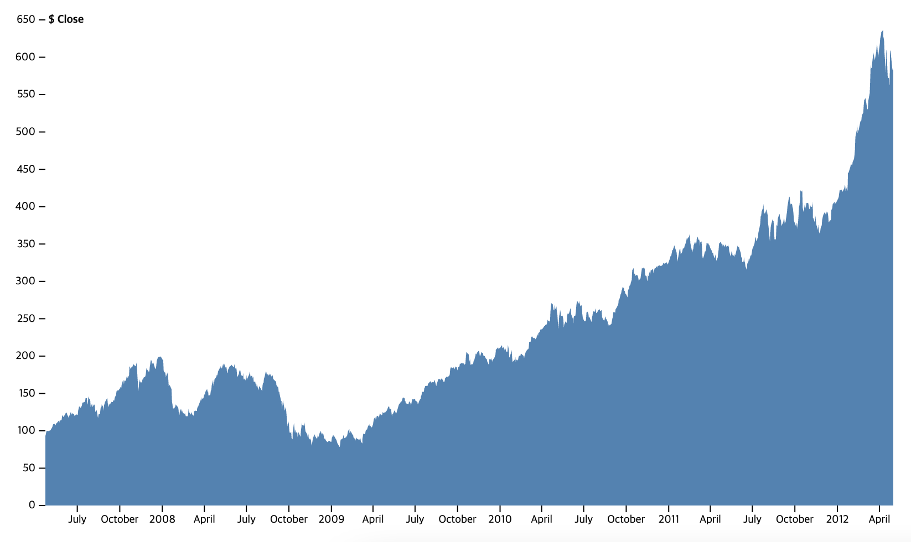
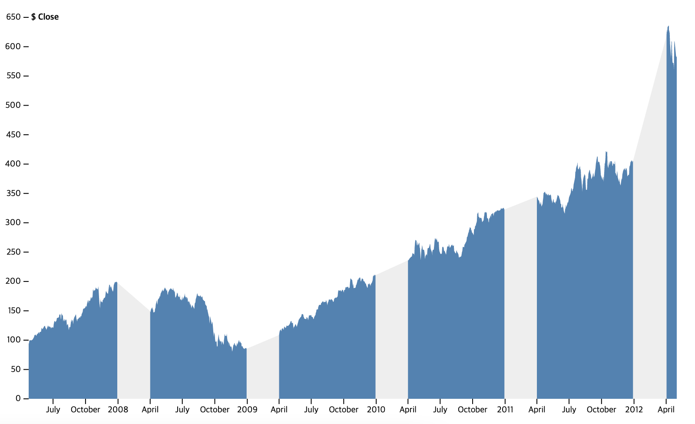

## Areas

1. [Area Chart](./AreaChart.vue) - [Original](https://observablehq.com/@d3/area-chart)

{: width="300" height="300"}

2. [Area with Missing Data](./AreaWithMissingData.vue) - [Original](https://observablehq.com/@d3/area-with-missing-data)

{: width="300" height="300"}