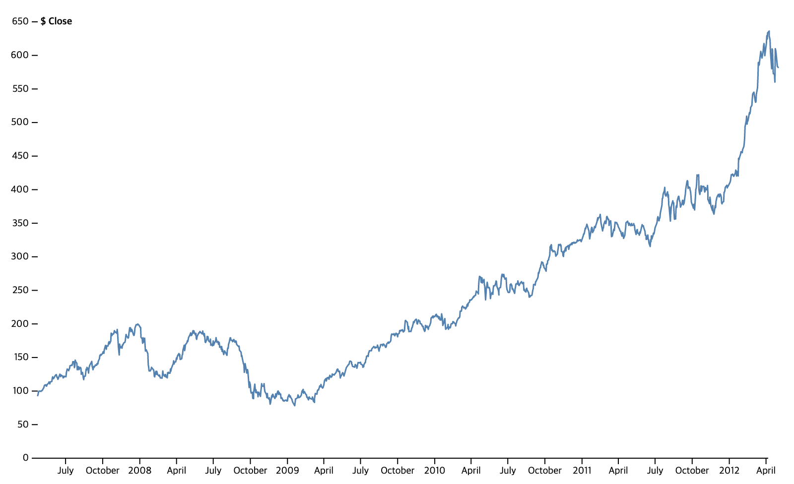
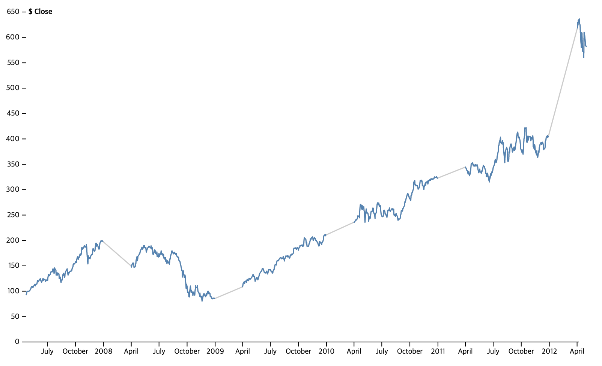

## Lines 

1. [Line Chart](./LineChart.vue) - [Original](https://observablehq.com/@d3/line-chart)

2. [Line with Missing Data](./LineWithMissingData.vue) - [Original](https://observablehq.com/@d3/line-with-missing-data) 

